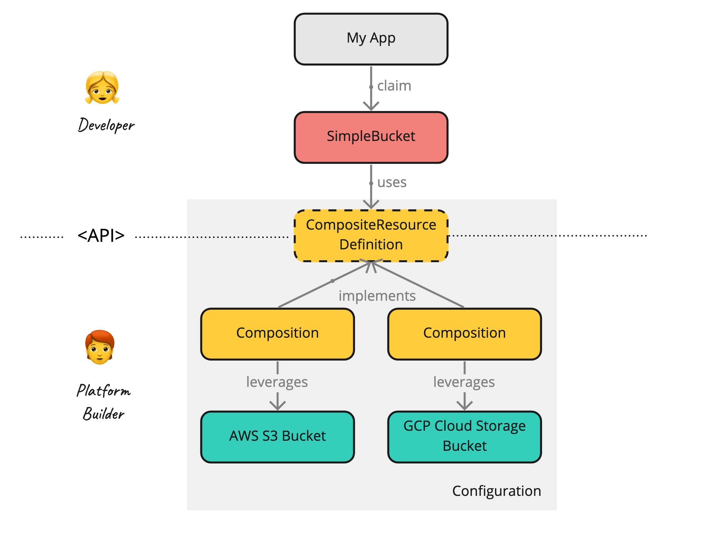

# Overview Getting Started: Step-by-Step

The following guide provides an easy, step-by-step path for developers and platform engineers to get familiar with Crossplane. It complements the current Getting Started guide, which focuses on getting an RDS Instance up and running quickly. In this example will use Object Storage as a simple example with quick turn around times.

Here is the full architectural overview: 

Don't worry about the different terms. We will introduce them on our way.

We will use this condensed form throught the guide: 

## TOC

* 1.) [Setup](01-setup.md): Setting up Crossplane on Kubernetes.
    * Create a K8s Cluster
    * Install the Crossplane CLI
    * Install the Crossplane Runtime
* 2a.) [Using Managed Resources from AWS](02a-managed-resources-aws.md): Connect Crossplane to manage AWS resources.
    * Install the AWS Provider 
    * Configure the AWS Provider
    * Create, Read, Update and Delete a S3 bucket
* 2b.) Using Managed Resources from GCP: Connect Crossplane to manage GCP resources.
    * Install the GCP Provider 
    * Configure the GCP Provider
    * Create, Read, Update and Delete a Cloud Storage bucket
* 3.) Building a Composite Resource: Build and use simplified and catered infrastructure APIs.
    * Create a CompositeResourceDefinition (XRD)
    * Create a CompositeResource (XR) which implements the XRD
    * Provision Infrastructure by Claiming it
    * Use the Provisioned Bucket 
* 4.) Build a Configuration Package
    * Bundle XRD and XR
    * Build and publish the configuration