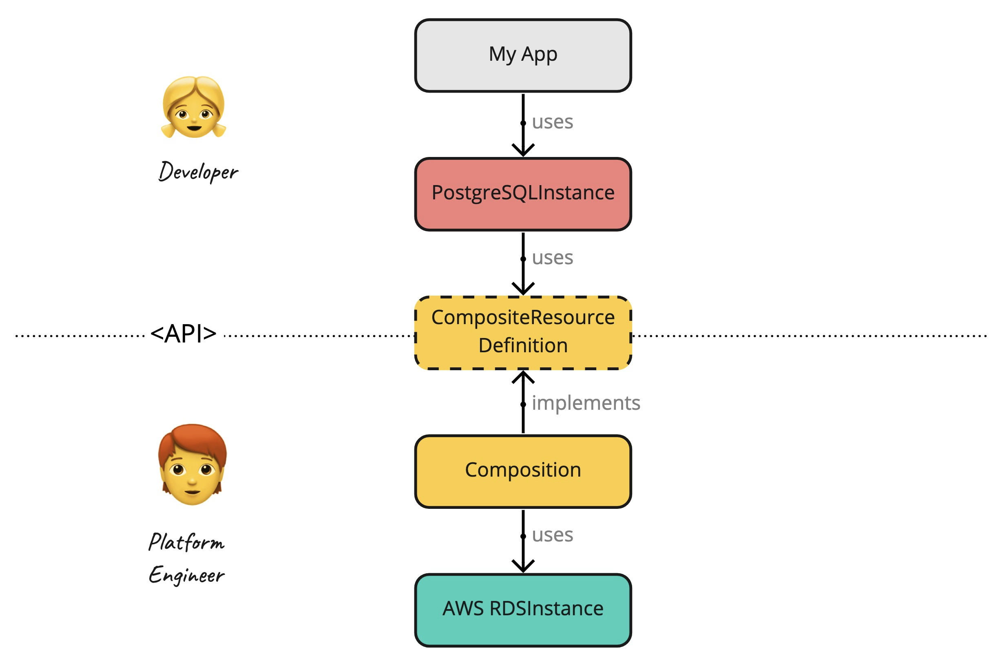

# Overview Getting Started: Step-by-Step

The following Step-By-Step Getting Started Guide provides an easy path for developers and platform engineers to get familiar with Crossplane by taking one step at a time. It complements the current Getting Started guide, which focuses on the shortest path. 

Our use-case is to ... (TBD Bucket or RDS Instance). Here is a quick architectural overview: 

Don't worry about the different terms. We will introduce them on our way.