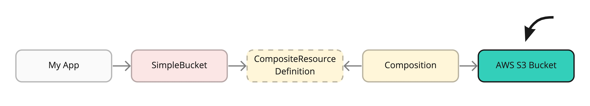

# Using Managed Resources from AWS: Connect Crossplane to manage AWS resources.

In this part, our goal is to configure Crossplane so we can launch and manage
AWS resources directly from within Kubernetes. We will leverage the power of the
Kubernetes machinery that continuously reconciles the desired state without any
manual interaction from users.

Please note that this is an intermediate step. The following step
[TODO](Building a Composite Resource) will unveal the true value of composing
these managed resources into a custom platform APIs.



* A) Install the AWS Provider
* B) Configure the AWS Provider
* C) Create, Update and Delete an S3 bucket

## Prerequisite

A running Kubernetes cluster & Crossplane runtime installed. See
[01-setup.md](Setup). The [AWS CLI](https://aws.amazon.com/cli/) installed.

## A) Install the AWS Provider

Cloud provider resources are bundled into a Crossplane packages called Provider.
We will install the AWS version v0.19:

### Run:
```Bash:
# Install the AWS provider with the Crossplane CLI:
$ kubectl crossplane install provider crossplane/provider-aws:v0.19
```

This provider package installed a couple of AWS specific CRDS which we will be
using.

### Check:
```Bash:
# Show all installed Provider:
# (currently only the AWS provider)
# (check for Installed & Healthy)
$ kubectl get providers

# Describe the AWS provider:
# (check for events and conditions)
$ kubectl describe provider provider-aws

# Show the CRDs the Provider has installed: 
$ kubectl get crds | grep aws.crossplane.io
```

## B) Configure the AWS Provider

The Provider package from the previous step just contains the resources and
needs to be configured. In this step we will install a ProviderConfig with a
secret containing the AWS credentials:

### Run:
```bash
# Create a creds.conf file with the aws cli:
AWS_PROFILE=default && echo -e "[default]\naws_access_key_id = $(aws configure get aws_access_key_id --profile $AWS_PROFILE)\naws_secret_access_key = $(aws configure get aws_secret_access_key --profile $AWS_PROFILE)" > creds.conf

# Create a secret with the AWS creds:
$ kubectl create secret generic aws-creds -n crossplane-system --from-file=creds=./creds.conf

# Configure AWS Provider by creating a ProviderConfig:
$ kubectl apply -f https://raw.githubusercontent.com/crossplane/crossplane/release-1.2/docs/snippets/configure/aws/providerconfig.yaml
```

### Check:
```bash
# Check secret: 
$ kubectl get secret aws-creds -n crossplane-system -o yaml
# 
$ kubectl describe providerconfig
```

## C) Create, Update and Delete an S3 bucket

In this last step we will be testing our AWS Provider by creating a S3 bucket,
update it and delete it. 

### Run:
```bash
# Create a (hopefully) unique S3 bucket name
BUCKET_NAME=test-bucket-$RANDOM

# Install an S3 bucket
$ cat <<EOF | kubectl apply -f -
apiVersion: s3.aws.crossplane.io/v1beta1
kind: Bucket
metadata:
  name: $BUCKET_NAME
spec:
  forProvider:
    acl: public-read-write
    locationConstraint: us-east-1
EOF
```

### Check:
```bash
```bash
# Show all managed resources
# (currently only one AWS S3 bucket)
$ kubectl get managed

# Show buckets 
# (currently the bucket we have just created)
$ kubectl get bucket
# The bucket information straight from AWS:
$ aws s3 ls

# Test the S3 bucket:
# Create and upload a test file:
$ echo hello-world > test.dat
$ aws s3 cp test.dat s3://$BUCKET_NAME

# Make the file accessible for the public:
$ aws s3api put-object-acl --bucket $BUCKET_NAME --key test.dat --grant-read uri=http://acs.amazonaws.com/groups/global/AllUsers
# View the file from the Internetz:
$ curl https://s3.amazonaws.com/$BUCKET_NAME/test.dat

# Remove files from the bucket:
$ aws s3 rm --recursive s3://$BUCKET_NAME
# Delete the managed resource which deletes the resource in AWS:
$ kubectl delete bucket $BUCKET_NAME
# $ aws s3 rb s3://$BUCKET_NAME
```

## Next

We have succesfully configured our first Provider and started using it directly. In the next step we will do the same with [GCP](TODO). You can skip the next step and start building a Building a [Composite Resource](TODO).

## More Info

<details><summary>About Providers</summary>

- TODO link to other cloud provider
- [https://cloud.upbound.io/registry/crossplane/provider-aws](https://cloud.upbound.io/registry/crossplane/provider-aws)
- https://crossplane.io/docs/v1.2/getting-started/install-configure.html#get-aws-account-keyfile
- https://github.com/crossplane/provider-aws/blob/master/package/crds/s3.aws.crossplane.io_buckets.yaml
</details>

<details><summary>Reconciliation Loops</summary>

- TODO expain more about the power of the reconcilation loop
</details>